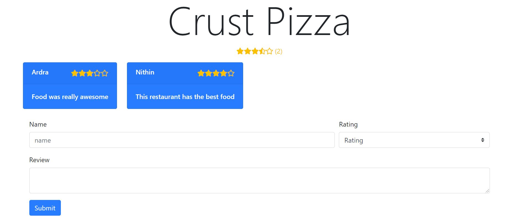

# Yelp Site with Pern Stack

Yelp Site made with pern Stack where i learn to use Postgres, Express , Node js with React

## Technologies Used

## Server Side 
- Node js,
- Express.js,
- nodemon,
- Postgres SQL,
- morgan,
- express.json(built in middleware)

## Client Side 
- React,
- Bootstrap,
- JSX,
- Fontawesome Icons
- axios

**Project Images**

 
 
 

